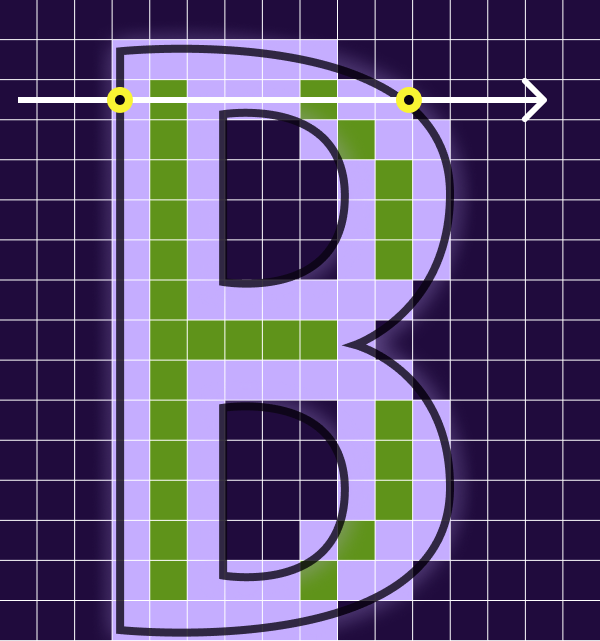
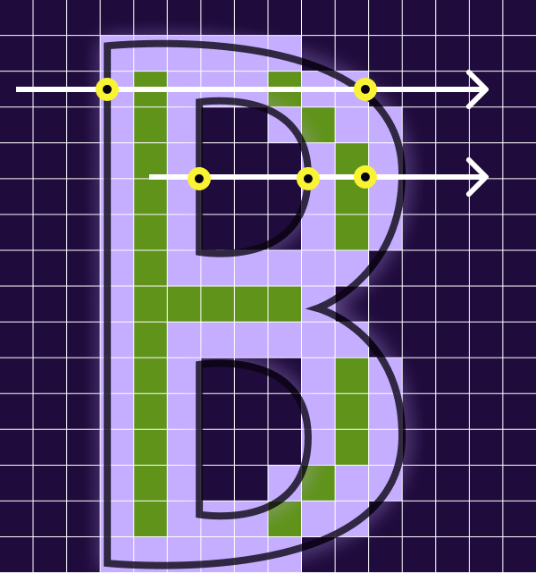
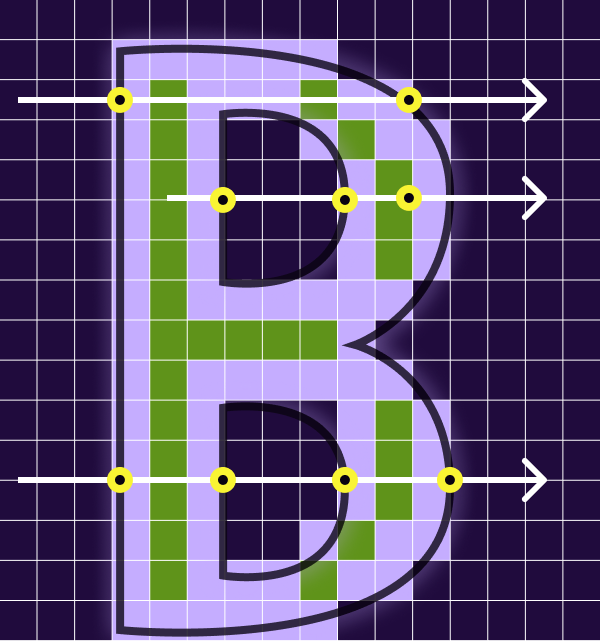

> Hey Y'all! This is a translation of my blog post originally written in Portuguese.
> If you want to read that version, [click here](/blog/font-rendering/).

On Saturday, July 26, 2025, I presented a lecture on font rendering at Google I/O Extended Natal. Due to the rush of daily life, I couldn't show many interactive practical examples. This article serves exactly that purpose: let's explore a bit about how the text you're reading is formed on your screen.

To start, we'll talk about Bitmaps. This is the most naive way to draw fonts, as a bitmap is nothing more than a ready-made image. Below, for example, we have a letter that occupies a space of 6 pixels in height by 6 pixels in width.

At the moment, you can easily visualize it because the pixel size is set to 10 pixels. However, if you change the size to 1 pixel, you'll see that it's not possible to read what's on the screen.

```p5
const glyphs = [
  { name: "a", data: { width: 6, height: 6, pixels: [
    [0,0,0,0,0,0],
    [0,0,0,1,0,0],
    [0,0,1,0,1,0],
    [0,1,0,0,1,0],
    [0,1,1,1,1,0],
    [0,1,0,0,1,0],
  ]}},
  { name: "c", data: { width: 6, height: 6, pixels: [
    [0,0,0,0,0,0],
    [0,0,1,1,1,0],
    [0,1,0,0,0,0],
    [0,1,0,0,0,0],
    [0,1,0,0,0,0],
    [0,0,1,1,1,0],
  ]}},
  { name: "f", data: { width: 6, height: 6, pixels: [
    [0,0,0,0,0,0],
    [0,1,1,1,0,0],
    [0,1,0,0,0,0],
    [0,1,1,0,0,0],
    [0,1,0,0,0,0],
    [0,1,0,0,0,0],
  ]}},
  { name: "g", data: { width: 6, height: 6, pixels: [
    [0,0,0,0,0,0],
    [0,0,1,1,1,0],
    [0,1,0,0,0,0],
    [0,1,0,1,1,0],
    [0,1,0,0,1,0],
    [0,0,1,1,1,0],
  ]}},
];

function bitmapToImageData(bitmap) {
  const { width, height, pixels } = bitmap;
  const data = new Uint8ClampedArray(width * height * 4);
  for (let y = 0; y < height; y++) {
    for (let x = 0; x < width; x++) {
      const idx = (y * width + x) * 4;
      const v = Math.round(Math.abs(pixels[y][x]) * 255);
      data[idx] = data[idx + 1] = data[idx + 2] = v;
      data[idx + 3] = 255;
    }
  }
  return new ImageData(data, width, height);
}

let pixelSlider;
let glyphRadio;
let currentBitmap = glyphs[0].data;
let imgData = bitmapToImageData(currentBitmap);

const COLORS = {};

let panX = 0;
let panY = 0;
let panLastX = null;
let panLastY = null;
const panInBounds = () =>
  sketch.mouseX >= 0 && sketch.mouseX <= sketch.width &&
  sketch.mouseY >= 0 && sketch.mouseY <= sketch.height;

sketch.mousePressed = function () {
  if (!panInBounds()) return;
  panLastX = sketch.mouseX;
  panLastY = sketch.mouseY;
};
sketch.mouseDragged = function () {
  if (panLastX === null) return;
  panX += sketch.mouseX - panLastX;
  panY += sketch.mouseY - panLastY;
  panLastX = sketch.mouseX;
  panLastY = sketch.mouseY;
};
sketch.mouseReleased = function () {
  panLastX = null;
  panLastY = null;
};

sketch.setup = function () {
  sketch.createCanvas(600, 400);
  sketch.canvas.dataset.pan = "true";

  const css = getComputedStyle(document.documentElement);
  COLORS.bg = css.getPropertyValue("--p5-bg").trim();
  COLORS.empty = sketch.color(css.getPropertyValue("--p5-pixel-empty").trim());
  COLORS.fg = sketch.color(css.getPropertyValue("--p5-fg").trim());
  COLORS.gridStroke = css.getPropertyValue("--p5-grid-stroke").trim();

  const controls = sketch.createDiv();
  controls.addClass("p5-controls");

  const labeledSlider = (label, min, max, value, step) => {
    const wrap = sketch.createDiv();
    wrap.parent(controls);
    wrap.addClass("p5-control");
    sketch.createElement("label", label).parent(wrap).addClass("p5-control-label");
    const s = step !== undefined
      ? sketch.createSlider(min, max, value, step)
      : sketch.createSlider(min, max, value);
    s.parent(wrap);
    s.addClass("p5-slider");
    return s;
  };

  const labeledRadio = (label, options, selected) => {
    const wrap = sketch.createDiv();
    wrap.parent(controls);
    wrap.addClass("p5-control");
    sketch.createElement("label", label).parent(wrap).addClass("p5-control-label");
    const r = sketch.createRadio();
    r.parent(wrap);
    for (const o of options) r.option(o);
    if (selected) r.selected(selected);
    r.addClass("p5-radio");
    return r;
  };

  pixelSlider = labeledSlider("Pixel size", 1, 50, 10);
  glyphRadio = labeledRadio("Letter", glyphs.map((g) => g.name), "a");
};

sketch.draw = function () {
  sketch.background(COLORS.bg);

  const ps = Number(pixelSlider.value());
  const selectedName = glyphRadio.value();
  const selected = glyphs.find((g) => g.name === selectedName);
  if (selected && selected.data !== currentBitmap) {
    currentBitmap = selected.data;
    imgData = bitmapToImageData(currentBitmap);
  }

  const totalW = currentBitmap.width * ps;
  const totalH = currentBitmap.height * ps;
  const offsetX = (sketch.width - totalW) / 2;
  const offsetY = (sketch.height - totalH) / 2;

  sketch.push();
  sketch.translate(panX, panY);

  for (let y = 0; y < currentBitmap.height; y++) {
    for (let x = 0; x < currentBitmap.width; x++) {
      const idx = (y * currentBitmap.width + x) * 4;
      const t = imgData.data[idx] / 255;
      sketch.fill(sketch.lerpColor(COLORS.empty, COLORS.fg, t));
      if (ps === 1) sketch.noStroke();
      else sketch.stroke(COLORS.gridStroke);
      sketch.rect(offsetX + x * ps, offsetY + y * ps, ps, ps);
    }
  }

  sketch.pop();
};
```

As shown, the biggest problem with bitmap fonts is that they are not scalable. That is, to change the font size, we would have to:

- Create a new font with each letter drawn in the new size.

- Rasterize the font at another scale.

Let's see what happens in the second option.

This is a simple scaling function. It receives as parameters the data of the letter you want to draw and the scale at which you want to increase it.

It works simply by duplicating existing pixels on both the _X_ and _Y_ axes.

```javascript
function scaleGlyph (glyph, scale) {
  const newWidth = Math.ceil(glyph.width * scale);
  const newHeight = Math.ceil(glyph.height * scale);
  const newPixels = Array.from({ length: newHeight }, () =>
    Array(newWidth).fill(0)
  );

  for (let y = 0; y < glyph.height; y++) {
    for (let x = 0; x < glyph.width; x++) {
      const value = glyph.pixels[y][x];
      const newX = Math.floor(x * scale);
      const newY = Math.floor(y * scale);
      for (let dy = 0; dy < scale; dy++) {
        for (let dx = 0; dx < scale; dx++) {
          if (newY + dy < newHeight && newX + dx < newWidth) {
            newPixels[newY + dy][newX + dx] = value;
          }
        }
      }
    }
  }
  return {
    width: newWidth,
    height: newHeight,
    pixels: newPixels,
  };
};
```

The problem with this type of scaling is that fonts end up getting a blocky appearance, which brings the feeling of a low-resolution image.

Another way is by applying scaling using linear interpolation. This technique consists of taking an average of all the original points around, instead of simply copying the entire block, blindly repeating what's in the pixel. However, this now results in a blurred image appearance, and this characteristic becomes more pronounced the greater the difference between the original size and the final size.

```javascript
function lerp(x0, v0, x1, v1, x) {
  if (x0 === x1) {
    return v0;
  }
  return v0 + (v1 - v0) * ((x - x0) / (x1 - x0));
}
```

```javascript
function bilinearInterpolate(Q11, Q21, Q12, Q22, x, y) {
  if (
    Q11.x !== Q12.x ||
    Q21.x !== Q22.x ||
    Q11.y !== Q21.y ||
    Q12.y !== Q22.y
  ) {
    console.error(
      "Error: The provided points do not form a proper rectangle for bilinear interpolation."
    );
  }

  const x1 = Q11.x;
  const x2 = Q21.x;
  const y1 = Q11.y;
  const y2 = Q12.y;

  const R1 = lerp(x1, Q11.value, x2, Q21.value, x);
  const R2 = lerp(x1, Q12.value, x2, Q22.value, x);
  const P = lerp(y1, R1, y2, R2, y);

  return P;
}
```

With this we have the examples below:

```p5
const glyphs = [
  { name: "a", data: { width: 6, height: 6, pixels: [
    [0,0,0,0,0,0],
    [0,0,0,1,0,0],
    [0,0,1,0,1,0],
    [0,1,0,0,1,0],
    [0,1,1,1,1,0],
    [0,1,0,0,1,0],
  ]}},
  { name: "c", data: { width: 6, height: 6, pixels: [
    [0,0,0,0,0,0],
    [0,0,1,1,1,0],
    [0,1,0,0,0,0],
    [0,1,0,0,0,0],
    [0,1,0,0,0,0],
    [0,0,1,1,1,0],
  ]}},
  { name: "f", data: { width: 6, height: 6, pixels: [
    [0,0,0,0,0,0],
    [0,1,1,1,0,0],
    [0,1,0,0,0,0],
    [0,1,1,0,0,0],
    [0,1,0,0,0,0],
    [0,1,0,0,0,0],
  ]}},
  { name: "g", data: { width: 6, height: 6, pixels: [
    [0,0,0,0,0,0],
    [0,0,1,1,1,0],
    [0,1,0,0,0,0],
    [0,1,0,1,1,0],
    [0,1,0,0,1,0],
    [0,0,1,1,1,0],
  ]}},
];

function bitmapToImageData(bitmap) {
  const { width, height, pixels } = bitmap;
  const data = new Uint8ClampedArray(width * height * 4);
  for (let y = 0; y < height; y++) {
    for (let x = 0; x < width; x++) {
      const idx = (y * width + x) * 4;
      const v = Math.round(Math.abs(pixels[y][x]) * 255);
      data[idx] = data[idx + 1] = data[idx + 2] = v;
      data[idx + 3] = 255;
    }
  }
  return new ImageData(data, width, height);
}

function scaleGlyph(glyph, scale) {
  const newWidth = Math.ceil(glyph.width * scale);
  const newHeight = Math.ceil(glyph.height * scale);
  const newPixels = Array.from({ length: newHeight }, () =>
    Array(newWidth).fill(0)
  );
  for (let y = 0; y < glyph.height; y++) {
    for (let x = 0; x < glyph.width; x++) {
      const value = glyph.pixels[y][x];
      const newX = Math.floor(x * scale);
      const newY = Math.floor(y * scale);
      for (let dy = 0; dy < scale; dy++) {
        for (let dx = 0; dx < scale; dx++) {
          if (newY + dy < newHeight && newX + dx < newWidth) {
            newPixels[newY + dy][newX + dx] = value;
          }
        }
      }
    }
  }
  return { width: newWidth, height: newHeight, pixels: newPixels };
}

function lerp(x0, v0, x1, v1, x) {
  if (x0 === x1) return v0;
  return v0 + (v1 - v0) * ((x - x0) / (x1 - x0));
}

function bilinearInterpolate(Q11, Q21, Q12, Q22, x, y) {
  const x1 = Q11.x;
  const x2 = Q21.x;
  const y1 = Q11.y;
  const y2 = Q12.y;
  const R1 = lerp(x1, Q11.value, x2, Q21.value, x);
  const R2 = lerp(x1, Q12.value, x2, Q22.value, x);
  return lerp(y1, R1, y2, R2, y);
}

function bilinearInterpolateGlyph(glyph, scale) {
  const newWidth = Math.ceil(glyph.width * scale);
  const newHeight = Math.ceil(glyph.height * scale);
  const newPixels = Array.from({ length: newHeight }, () =>
    Array(newWidth).fill(0)
  );
  for (let ny = 0; ny < newHeight; ny++) {
    for (let nx = 0; nx < newWidth; nx++) {
      const sx = nx / scale;
      const sy = ny / scale;
      const x1 = Math.floor(sx);
      const x2 = Math.min(x1 + 1, glyph.width - 1);
      const y1 = Math.floor(sy);
      const y2 = Math.min(y1 + 1, glyph.height - 1);
      const Q11 = { x: x1, y: y1, value: glyph.pixels[y1][x1] };
      const Q21 = { x: x2, y: y1, value: glyph.pixels[y1][x2] };
      const Q12 = { x: x1, y: y2, value: glyph.pixels[y2][x1] };
      const Q22 = { x: x2, y: y2, value: glyph.pixels[y2][x2] };
      newPixels[ny][nx] = bilinearInterpolate(Q11, Q21, Q12, Q22, sx, sy);
    }
  }
  return { width: newWidth, height: newHeight, pixels: newPixels };
}

let pixelSlider;
let hardSlider;
let glyphRadio;

const COLORS = {};

let panX = 0;
let panY = 0;
let panLastX = null;
let panLastY = null;
const panInBounds = () =>
  sketch.mouseX >= 0 && sketch.mouseX <= sketch.width &&
  sketch.mouseY >= 0 && sketch.mouseY <= sketch.height;

sketch.mousePressed = function () {
  if (!panInBounds()) return;
  panLastX = sketch.mouseX;
  panLastY = sketch.mouseY;
};
sketch.mouseDragged = function () {
  if (panLastX === null) return;
  panX += sketch.mouseX - panLastX;
  panY += sketch.mouseY - panLastY;
  panLastX = sketch.mouseX;
  panLastY = sketch.mouseY;
};
sketch.mouseReleased = function () {
  panLastX = null;
  panLastY = null;
};

sketch.setup = function () {
  sketch.createCanvas(600, 400);
  sketch.canvas.dataset.pan = "true";

  const css = getComputedStyle(document.documentElement);
  COLORS.bg = css.getPropertyValue("--p5-bg").trim();
  COLORS.empty = sketch.color(css.getPropertyValue("--p5-pixel-empty").trim());
  COLORS.fg = sketch.color(css.getPropertyValue("--p5-fg").trim());
  COLORS.gridStroke = css.getPropertyValue("--p5-grid-stroke").trim();

  const controls = sketch.createDiv();
  controls.addClass("p5-controls");

  const labeledSlider = (label, min, max, value, step) => {
    const wrap = sketch.createDiv();
    wrap.parent(controls);
    wrap.addClass("p5-control");
    sketch.createElement("label", label).parent(wrap).addClass("p5-control-label");
    const s = step !== undefined
      ? sketch.createSlider(min, max, value, step)
      : sketch.createSlider(min, max, value);
    s.parent(wrap);
    s.addClass("p5-slider");
    return s;
  };

  const labeledRadio = (label, options, selected) => {
    const wrap = sketch.createDiv();
    wrap.parent(controls);
    wrap.addClass("p5-control");
    sketch.createElement("label", label).parent(wrap).addClass("p5-control-label");
    const r = sketch.createRadio();
    r.parent(wrap);
    for (const o of options) r.option(o);
    if (selected) r.selected(selected);
    r.addClass("p5-radio");
    return r;
  };

  pixelSlider = labeledSlider("Pixel size", 1, 30, 15);
  hardSlider = labeledSlider("Hard scale", 1, 10, 5);
  glyphRadio = labeledRadio("Letter", glyphs.map((g) => g.name), "a");
};

sketch.draw = function () {
  sketch.background(COLORS.bg);

  const ps = Number(pixelSlider.value());
  const hard = Number(hardSlider.value());
  const selectedName = glyphRadio.value();
  const selected = glyphs.find((g) => g.name === selectedName) || glyphs[0];

  const rem =
    parseFloat(getComputedStyle(document.documentElement).fontSize) || 16;
  const gap = 4 * rem;

  function render(glyph, slot) {
    const img = bitmapToImageData(glyph);
    const totalW = glyph.width * ps;
    const totalH = glyph.height * ps;
    const pairW = 2 * totalW + gap;
    const baseX = (sketch.width - pairW) / 2;
    const offsetX = baseX + slot * (totalW + gap);
    const offsetY = (sketch.height - totalH) / 2;

    for (let y = 0; y < glyph.height; y++) {
      for (let x = 0; x < glyph.width; x++) {
        const idx = (y * glyph.width + x) * 4;
        const t = img.data[idx] / 255;
        sketch.fill(sketch.lerpColor(COLORS.empty, COLORS.fg, t));
        if (ps === 1) sketch.noStroke();
        else sketch.stroke(COLORS.gridStroke);
        sketch.rect(offsetX + x * ps, offsetY + y * ps, ps, ps);
      }
    }
  }

  sketch.push();
  sketch.translate(panX, panY);

  // Left: nearest-neighbour scale (blocky). Right: bilinear (blurry).
  render(scaleGlyph(selected.data, hard), 0);
  render(bilinearInterpolateGlyph(selected.data, hard), 1);

  sketch.pop();
};
```

### How to use one font for multiple sizes?

In mathematics, there are equations that draw a graph on the screen. The most common examples are:

#### Quadratic function

```observable:notebook
<script id="1" type="ojs">
viewof quadraticFunctionBase = Plot.plot({
  grid: true,
  y: { label: "↑ y = x²" },
  marks: [
    Plot.frame(),
    Plot.ruleX([0]),
    Plot.ruleY([0]),
    Plot.line(
      Array.from({ length: 201 }, (_, i) => {
        const x = (i - 100) / 10;
        return { x, y: x * x };
      }),
      {
        x: "x",
        y: "y",
        stroke: getComputedStyle(document.documentElement).getPropertyValue("--accent").trim(),
        strokeWidth: 3
      }
    )
  ]
})
</script>
```

#### Multiplicative inverse function

```observable:notebook
<script id="2" type="ojs">
viewof iverseFunction = Plot.plot({
  grid: true,
  y: { label: "↑ y = 1/x" },
  marks: [
    Plot.frame(),
    Plot.ruleX([0]),
    Plot.ruleY([0]),
    Plot.line(
      Array.from({ length: 100 }, (_, i) => {
        const x = -10 + i * (9.9 / 99);
        return { x, y: 1 / x };
      }),
      {
        x: "x",
        y: "y",
        stroke: getComputedStyle(document.documentElement).getPropertyValue("--accent").trim(),
        strokeWidth: 3
      }
    ),
    Plot.line(
      Array.from({ length: 100 }, (_, i) => {
        const x = 0.1 + i * (9.9 / 99);
        return { x, y: 1 / x };
      }),
      {
        x: "x",
        y: "y",
        stroke: getComputedStyle(document.documentElement).getPropertyValue("--accent").trim(),
        strokeWidth: 3
      }
    )
  ]
})
</script>
```

To move our equations, we can add any value after the result of the exponentiation, and thus we move our equation on the _Y_ axis.

```observable:notebook
<script id="3" type="ojs">
viewof yOffsetQuadratic = Plot.plot({
  grid: true,
  y: { label: `↑ y = x² + ${quadraticYOffset}` },
  marks: [
    Plot.frame(),
    Plot.ruleX([0]),
    Plot.ruleY([0]),
    Plot.line(
      Array.from({ length: 201 }, (_, i) => {
        const x = (i - 100) / 10;
        return { x, y: Math.pow(x, 2) + quadraticYOffset };
      }),
      {
        x: "x",
        y: "y",
        stroke: getComputedStyle(document.documentElement).getPropertyValue("--accent").trim(),
        strokeWidth: 3
      }
    )
  ]
})
</script>
<script id="4" type="ojs">
viewof quadraticYOffset = Inputs.range([0, 100], {
  value: 20,
  step: 5,
  label: "Y offset",
})
</script>
```

To move our equation horizontally, we add that value before squaring it.

```observable:notebook
<script id="5" type="ojs">
viewof horizonralOffsetQuadratic = Plot.plot({
  grid: true,
  y: { label: "↑ y = (x + 2)²" },
  marks: [
    Plot.frame(),
    Plot.ruleX([0]),
    Plot.ruleY([0]),
    Plot.line(
      Array.from({ length: 201 }, (_, i) => {
        const x = (i - 100) / 10;
        return { x, y: Math.pow(x + quadraticXOffset, 2) };
      }),
      {
        x: "x",
        y: "y",
        stroke: getComputedStyle(document.documentElement).getPropertyValue("--accent").trim(),
        strokeWidth: 3
      }
    )
  ]
})
</script>
<script id="6" type="ojs">
viewof quadraticXOffset = Inputs.range([-10, 10], {
  value: -2,
  step: 1,
  label: "X offset",
})
</script>
```

So, we already have a way to represent our curves using mathematical equations.

But before we draw, let's learn about one more thing: Bézier curves. It's a polynomial curve expressed as the linear interpolation between some representative points, called control points.

In the example below, we have 3 points: _P0_, _P1_ and _P2_, where _P0_ and _P2_ are the representative points and _P1_ is the control point.

You can move the examples below and see the result.

```p5
// The original Observable cell named its p5 instance `p`; alias here
// so the body keeps its shape (`p.setup`, `p.draw`, helper functions
// that close over `p`) instead of a noisy rename.
const p = sketch;

// The three points defining the quadratic Bézier curve
let p0, p1, p2;

// `t` walks from 0 → 1 over time to drive the interpolation animation
let t = 0;
const animationSpeed = 0.0075;

// Drag handle bookkeeping
let draggedPoint = null;
const pointRadius = 10;

const COLORS = {};

p.setup = function () {
  p.createCanvas(600, 400);

  const css = getComputedStyle(document.documentElement);
  COLORS.bg = css.getPropertyValue("--p5-bg").trim();
  COLORS.fg = css.getPropertyValue("--p5-fg").trim();
  COLORS.curve = css.getPropertyValue("--p5-curve").trim();
  COLORS.guide = css.getPropertyValue("--p5-guide").trim();
  COLORS.lerp = css.getPropertyValue("--p5-lerp").trim();
  COLORS.marker = css.getPropertyValue("--p5-marker").trim();
  COLORS.text = css.getPropertyValue("--p5-text").trim();

  p0 = p.createVector(p.width * 0.15, p.height * 0.8);
  p1 = p.createVector(p.width * 0.5, p.height * 0.2);
  p2 = p.createVector(p.width * 0.85, p.height * 0.8);
};

p.draw = function () {
  p.background(COLORS.bg);

  drawCurvePath();

  const Vector = p.constructor.Vector;
  const q0 = Vector.lerp(p0, p1, t);
  const q1 = Vector.lerp(p1, p2, t);
  const b = Vector.lerp(q0, q1, t);

  drawGuideLines(q0, q1);
  drawControlPoints();
  drawInterpolatedPoints(q0, q1);
  drawBezierPoint(b);
  drawTValue();

  t += animationSpeed;
  if (t > 1) t = 0;
};

function drawCurvePath() {
  p.noFill();
  p.strokeWeight(2);
  p.stroke(COLORS.curve);
  p.beginShape();
  const Vector = p.constructor.Vector;
  for (let i = 0; i <= 1; i += 0.01) {
    const pq0 = Vector.lerp(p0, p1, i);
    const pq1 = Vector.lerp(p1, p2, i);
    const pb = Vector.lerp(pq0, pq1, i);
    p.vertex(pb.x, pb.y);
  }
  p.endShape();
}

function drawGuideLines(q0, q1) {
  p.strokeWeight(1);
  p.stroke(COLORS.guide);
  p.line(p0.x, p0.y, p1.x, p1.y);
  p.line(p1.x, p1.y, p2.x, p2.y);

  p.strokeWeight(2);
  p.stroke(COLORS.lerp);
  p.line(q0.x, q0.y, q1.x, q1.y);
}

function drawControlPoints() {
  p.noStroke();
  p.fill(COLORS.fg);
  p.ellipse(p0.x, p0.y, pointRadius * 1.5);
  p.ellipse(p1.x, p1.y, pointRadius * 1.5);
  p.ellipse(p2.x, p2.y, pointRadius * 1.5);

  p.fill(COLORS.fg);
  p.textSize(14);
  p.text("P0", p0.x - 25, p0.y + 5);
  p.text("P1", p1.x, p1.y - 15);
  p.text("P2", p2.x + 10, p2.y + 5);
}

function drawInterpolatedPoints(q0, q1) {
  p.noStroke();
  p.fill(COLORS.curve);
  p.ellipse(q0.x, q0.y, pointRadius);
  p.ellipse(q1.x, q1.y, pointRadius);

  p.fill(COLORS.curve);
  p.textSize(14);
  p.text("Q0", q0.x - 25, q0.y + 5);
  p.text("Q1", q1.x + 10, q1.y + 5);
}

function drawBezierPoint(b) {
  p.noStroke();
  p.fill(COLORS.marker);
  p.ellipse(b.x, b.y, pointRadius * 1.8);
}

function drawTValue() {
  p.fill(COLORS.text);
  p.noStroke();
  p.textSize(16);
  p.textFont("monospace");
  p.text("t = " + t.toFixed(2), 20, 30);
}

p.mousePressed = function () {
  if (p.dist(p.mouseX, p.mouseY, p0.x, p0.y) < pointRadius) {
    draggedPoint = p0;
  } else if (p.dist(p.mouseX, p.mouseY, p1.x, p1.y) < pointRadius) {
    draggedPoint = p1;
  } else if (p.dist(p.mouseX, p.mouseY, p2.x, p2.y) < pointRadius) {
    draggedPoint = p2;
  }
};

p.mouseDragged = function () {
  if (draggedPoint) {
    draggedPoint.x = p.mouseX;
    draggedPoint.y = p.mouseY;
  }
};

p.mouseReleased = function () {
  draggedPoint = null;
};
```

## Drawing a letter with vectors

```p5
// Vector contours: each glyph is one or more closed contours (outer
// shape and, for letters like "O", an inner hole). Every point flags
// whether it sits ON the curve (an actual anchor) or OFF (a Bézier
// control point) — the visualization draws on-curve points filled,
// off-curve points hollow.
const eVector = [
  {
    type: "outer",
    points: [
      { x: 88.0, y: 1020.0, onCurve: true },
      { x: 88.0, y: 655.0, onCurve: false },
      { x: 88.0, y: 290.0, onCurve: true },
      { x: 307.0, y: 290.0, onCurve: false },
      { x: 526.0, y: 290.0, onCurve: true },
      { x: 526.0, y: 345.0, onCurve: false },
      { x: 526.0, y: 400.0, onCurve: true },
      { x: 368.5, y: 400.0, onCurve: false },
      { x: 211.0, y: 400.0, onCurve: true },
      { x: 211.0, y: 495.0, onCurve: false },
      { x: 211.0, y: 590.0, onCurve: true },
      { x: 351.0, y: 590.0, onCurve: false },
      { x: 491.0, y: 590.0, onCurve: true },
      { x: 491.0, y: 643.0, onCurve: false },
      { x: 491.0, y: 696.0, onCurve: true },
      { x: 351.0, y: 696.0, onCurve: false },
      { x: 211.0, y: 696.0, onCurve: true },
      { x: 211.0, y: 803.0, onCurve: false },
      { x: 211.0, y: 910.0, onCurve: true },
      { x: 368.5, y: 910.0, onCurve: false },
      { x: 526.0, y: 910.0, onCurve: true },
      { x: 526.0, y: 965.0, onCurve: false },
      { x: 526.0, y: 1020.0, onCurve: true },
      { x: 88.0, y: 1020.0, onCurve: true },
    ],
  },
];

const oVector = [
  {
    type: "outer",
    points: [
      { x: 300.0, y: 1030.0, onCurve: true },
      { x: 195.0, y: 1030.0, onCurve: false },
      { x: 133.5, y: 970.0, onCurve: true },
      { x: 72.0, y: 910.0, onCurve: false },
      { x: 72.0, y: 804.0, onCurve: true },
      { x: 72.0, y: 655.0, onCurve: false },
      { x: 72.0, y: 506.0, onCurve: true },
      { x: 72.0, y: 400.0, onCurve: false },
      { x: 133.5, y: 340.0, onCurve: true },
      { x: 195.0, y: 280.0, onCurve: false },
      { x: 300.0, y: 280.0, onCurve: true },
      { x: 405.0, y: 280.0, onCurve: false },
      { x: 466.5, y: 340.0, onCurve: true },
      { x: 528.0, y: 400.0, onCurve: false },
      { x: 528.0, y: 505.0, onCurve: true },
      { x: 528.0, y: 654.5, onCurve: false },
      { x: 528.0, y: 804.0, onCurve: true },
      { x: 528.0, y: 910.0, onCurve: false },
      { x: 466.5, y: 970.0, onCurve: true },
      { x: 405.0, y: 1030.0, onCurve: false },
    ],
  },
  {
    type: "inner",
    points: [
      { x: 300.0, y: 920.0, onCurve: true },
      { x: 351.0, y: 920.0, onCurve: false },
      { x: 377.0, y: 892.5, onCurve: true },
      { x: 403.0, y: 865.0, onCurve: false },
      { x: 403.0, y: 814.0, onCurve: true },
      { x: 403.0, y: 655.0, onCurve: false },
      { x: 403.0, y: 496.0, onCurve: true },
      { x: 403.0, y: 445.0, onCurve: false },
      { x: 377.0, y: 417.5, onCurve: true },
      { x: 351.0, y: 390.0, onCurve: false },
      { x: 300.0, y: 390.0, onCurve: true },
      { x: 249.0, y: 390.0, onCurve: false },
      { x: 223.0, y: 417.5, onCurve: true },
      { x: 197.0, y: 445.0, onCurve: false },
      { x: 197.0, y: 496.0, onCurve: true },
      { x: 197.0, y: 655.0, onCurve: false },
      { x: 197.0, y: 814.0, onCurve: true },
      { x: 197.0, y: 865.0, onCurve: false },
      { x: 223.0, y: 892.5, onCurve: true },
      { x: 249.0, y: 920.0, onCurve: false },
    ],
  },
];

const vectors = [
  { name: "E", data: eVector },
  { name: "O", data: oVector },
];

let scaleSlider;
let vectorRadio;

const COLORS = {};

let panX = 0;
let panY = 0;
let panLastX = null;
let panLastY = null;
const panInBounds = () =>
  sketch.mouseX >= 0 && sketch.mouseX <= sketch.width &&
  sketch.mouseY >= 0 && sketch.mouseY <= sketch.height;

sketch.mousePressed = function () {
  if (!panInBounds()) return;
  panLastX = sketch.mouseX;
  panLastY = sketch.mouseY;
};
sketch.mouseDragged = function () {
  if (panLastX === null) return;
  panX += sketch.mouseX - panLastX;
  panY += sketch.mouseY - panLastY;
  panLastX = sketch.mouseX;
  panLastY = sketch.mouseY;
};
sketch.mouseReleased = function () {
  panLastX = null;
  panLastY = null;
};

sketch.setup = function () {
  sketch.createCanvas(600, 400);
  sketch.canvas.dataset.pan = "true";

  const css = getComputedStyle(document.documentElement);
  COLORS.bg = css.getPropertyValue("--p5-bg").trim();
  COLORS.fg = css.getPropertyValue("--p5-fg").trim();
  COLORS.outline = css.getPropertyValue("--p5-outline").trim();

  const controls = sketch.createDiv();
  controls.addClass("p5-controls");

  const labeledSlider = (label, min, max, value, step) => {
    const wrap = sketch.createDiv();
    wrap.parent(controls);
    wrap.addClass("p5-control");
    sketch.createElement("label", label).parent(wrap).addClass("p5-control-label");
    const s = step !== undefined
      ? sketch.createSlider(min, max, value, step)
      : sketch.createSlider(min, max, value);
    s.parent(wrap);
    s.addClass("p5-slider");
    return s;
  };

  const labeledRadio = (label, options, selected) => {
    const wrap = sketch.createDiv();
    wrap.parent(controls);
    wrap.addClass("p5-control");
    sketch.createElement("label", label).parent(wrap).addClass("p5-control-label");
    const r = sketch.createRadio();
    r.parent(wrap);
    for (const o of options) r.option(o);
    if (selected) r.selected(selected);
    r.addClass("p5-radio");
    return r;
  };

  // Glyph coordinates run to ~1020; we need a 0.x scale to land inside
  // a 400-tall canvas.
  scaleSlider = labeledSlider("Rasterization scale", 0.1, 1, 0.3, 0.01);
  vectorRadio = labeledRadio("Letter", vectors.map((v) => v.name), "O");
};

sketch.draw = function () {
  sketch.background(COLORS.bg);

  const rs = scaleSlider.value();
  const selectedName = vectorRadio.value();
  const selected = vectors.find((v) => v.name === selectedName) || vectors[1];
  const xOffset = sketch.width / 2.5;

  sketch.push();
  sketch.translate(panX, panY);

  for (const contour of selected.data) {
    const points = contour.points;

    sketch.strokeWeight(2);
    sketch.stroke(COLORS.outline);
    sketch.noFill();
    sketch.beginShape();
    for (const pt of points) {
      sketch.vertex(pt.x * rs + xOffset, pt.y * rs);
    }
    sketch.endShape(sketch.CLOSE);

    sketch.stroke(COLORS.outline);
    for (const pt of points) {
      if (pt.onCurve) sketch.fill(COLORS.fg);
      else sketch.fill(COLORS.bg);
      sketch.circle(pt.x * rs + xOffset, pt.y * rs, 10);
    }
  }

  sketch.pop();
};
```

With the Bézier concept, it becomes quite intuitive how we can draw a letter using mathematics: just organize points in sequence and mix straight lines with Bézier curves, making the _P2_ of one end exactly where the _P0_ of the other begins.

By the way, a straight line can also be made with Bézier; just align all the points. This way, it becomes even clearer how interpolation acts on the Bézier curve.

```p5
// Same Bézier sketch as the previous block, but with all three points
// initialised on a single horizontal line — illustrating that an
// aligned set of control points collapses the curve to a straight
// line (Bézier interpolation degenerates to plain lerp).
const p = sketch;

let p0, p1, p2;
let t = 0;
const animationSpeed = 0.0075;

let draggedPoint = null;
const pointRadius = 10;

const COLORS = {};

p.setup = function () {
  p.createCanvas(600, 200);

  const css = getComputedStyle(document.documentElement);
  COLORS.bg = css.getPropertyValue("--p5-bg").trim();
  COLORS.fg = css.getPropertyValue("--p5-fg").trim();
  COLORS.curve = css.getPropertyValue("--p5-curve").trim();
  COLORS.guide = css.getPropertyValue("--p5-guide").trim();
  COLORS.lerp = css.getPropertyValue("--p5-lerp").trim();
  COLORS.marker = css.getPropertyValue("--p5-marker").trim();
  COLORS.text = css.getPropertyValue("--p5-text").trim();

  p0 = p.createVector(p.width * 0.15, p.height * 0.8);
  p1 = p.createVector(p.width * 0.5, p.height * 0.8);
  p2 = p.createVector(p.width * 0.85, p.height * 0.8);
};

p.draw = function () {
  p.background(COLORS.bg);

  drawCurvePath();

  const Vector = p.constructor.Vector;
  const q0 = Vector.lerp(p0, p1, t);
  const q1 = Vector.lerp(p1, p2, t);
  const b = Vector.lerp(q0, q1, t);

  drawGuideLines(q0, q1);
  drawControlPoints();
  drawInterpolatedPoints(q0, q1);
  drawBezierPoint(b);
  drawTValue();

  t += animationSpeed;
  if (t > 1) t = 0;
};

function drawCurvePath() {
  p.noFill();
  p.strokeWeight(2);
  p.stroke(COLORS.curve);
  p.beginShape();
  const Vector = p.constructor.Vector;
  for (let i = 0; i <= 1; i += 0.01) {
    const pq0 = Vector.lerp(p0, p1, i);
    const pq1 = Vector.lerp(p1, p2, i);
    const pb = Vector.lerp(pq0, pq1, i);
    p.vertex(pb.x, pb.y);
  }
  p.endShape();
}

function drawGuideLines(q0, q1) {
  p.strokeWeight(1);
  p.stroke(COLORS.guide);
  p.line(p0.x, p0.y, p1.x, p1.y);
  p.line(p1.x, p1.y, p2.x, p2.y);

  p.strokeWeight(2);
  p.stroke(COLORS.lerp);
  p.line(q0.x, q0.y, q1.x, q1.y);
}

function drawControlPoints() {
  p.noStroke();
  p.fill(COLORS.fg);
  p.ellipse(p0.x, p0.y, pointRadius * 1.5);
  p.ellipse(p1.x, p1.y, pointRadius * 1.5);
  p.ellipse(p2.x, p2.y, pointRadius * 1.5);

  p.fill(COLORS.fg);
  p.textSize(14);
  p.text("P0", p0.x - 25, p0.y + 5);
  p.text("P1", p1.x, p1.y - 15);
  p.text("P2", p2.x + 10, p2.y + 5);
}

function drawInterpolatedPoints(q0, q1) {
  p.noStroke();
  p.fill(COLORS.curve);
  p.ellipse(q0.x, q0.y, pointRadius);
  p.ellipse(q1.x, q1.y, pointRadius);

  p.fill(COLORS.curve);
  p.textSize(14);
  p.text("Q0", q0.x - 25, q0.y + 5);
  p.text("Q1", q1.x + 10, q1.y + 5);
}

function drawBezierPoint(b) {
  p.noStroke();
  p.fill(COLORS.marker);
  p.ellipse(b.x, b.y, pointRadius * 1.8);
}

function drawTValue() {
  p.fill(COLORS.text);
  p.noStroke();
  p.textSize(16);
  p.textFont("monospace");
  p.text("t = " + t.toFixed(2), 20, 30);
}

p.mousePressed = function () {
  if (p.dist(p.mouseX, p.mouseY, p0.x, p0.y) < pointRadius) {
    draggedPoint = p0;
  } else if (p.dist(p.mouseX, p.mouseY, p1.x, p1.y) < pointRadius) {
    draggedPoint = p1;
  } else if (p.dist(p.mouseX, p.mouseY, p2.x, p2.y) < pointRadius) {
    draggedPoint = p2;
  }
};

p.mouseDragged = function () {
  if (draggedPoint) {
    draggedPoint.x = p.mouseX;
    draggedPoint.y = p.mouseY;
  }
};

p.mouseReleased = function () {
  draggedPoint = null;
};
```

With this, we can now think about how to transform this into a bitmap. To do this, we first need to rasterize this font, starting by translating the Bézier curves into lines compatible with the screen resolution. This happens because the computer screen is a matrix of pixels; therefore, we need to transform curves into pixels readable to the human eye.

```p5
const eVector = [
  {
    type: "outer",
    points: [
      { x: 88.0, y: 1020.0, onCurve: true },
      { x: 88.0, y: 655.0, onCurve: false },
      { x: 88.0, y: 290.0, onCurve: true },
      { x: 307.0, y: 290.0, onCurve: false },
      { x: 526.0, y: 290.0, onCurve: true },
      { x: 526.0, y: 345.0, onCurve: false },
      { x: 526.0, y: 400.0, onCurve: true },
      { x: 368.5, y: 400.0, onCurve: false },
      { x: 211.0, y: 400.0, onCurve: true },
      { x: 211.0, y: 495.0, onCurve: false },
      { x: 211.0, y: 590.0, onCurve: true },
      { x: 351.0, y: 590.0, onCurve: false },
      { x: 491.0, y: 590.0, onCurve: true },
      { x: 491.0, y: 643.0, onCurve: false },
      { x: 491.0, y: 696.0, onCurve: true },
      { x: 351.0, y: 696.0, onCurve: false },
      { x: 211.0, y: 696.0, onCurve: true },
      { x: 211.0, y: 803.0, onCurve: false },
      { x: 211.0, y: 910.0, onCurve: true },
      { x: 368.5, y: 910.0, onCurve: false },
      { x: 526.0, y: 910.0, onCurve: true },
      { x: 526.0, y: 965.0, onCurve: false },
      { x: 526.0, y: 1020.0, onCurve: true },
      { x: 88.0, y: 1020.0, onCurve: true },
    ],
  },
];

const oVector = [
  {
    type: "outer",
    points: [
      { x: 300.0, y: 1030.0, onCurve: true },
      { x: 195.0, y: 1030.0, onCurve: false },
      { x: 133.5, y: 970.0, onCurve: true },
      { x: 72.0, y: 910.0, onCurve: false },
      { x: 72.0, y: 804.0, onCurve: true },
      { x: 72.0, y: 655.0, onCurve: false },
      { x: 72.0, y: 506.0, onCurve: true },
      { x: 72.0, y: 400.0, onCurve: false },
      { x: 133.5, y: 340.0, onCurve: true },
      { x: 195.0, y: 280.0, onCurve: false },
      { x: 300.0, y: 280.0, onCurve: true },
      { x: 405.0, y: 280.0, onCurve: false },
      { x: 466.5, y: 340.0, onCurve: true },
      { x: 528.0, y: 400.0, onCurve: false },
      { x: 528.0, y: 505.0, onCurve: true },
      { x: 528.0, y: 654.5, onCurve: false },
      { x: 528.0, y: 804.0, onCurve: true },
      { x: 528.0, y: 910.0, onCurve: false },
      { x: 466.5, y: 970.0, onCurve: true },
      { x: 405.0, y: 1030.0, onCurve: false },
    ],
  },
  {
    type: "inner",
    points: [
      { x: 300.0, y: 920.0, onCurve: true },
      { x: 351.0, y: 920.0, onCurve: false },
      { x: 377.0, y: 892.5, onCurve: true },
      { x: 403.0, y: 865.0, onCurve: false },
      { x: 403.0, y: 814.0, onCurve: true },
      { x: 403.0, y: 655.0, onCurve: false },
      { x: 403.0, y: 496.0, onCurve: true },
      { x: 403.0, y: 445.0, onCurve: false },
      { x: 377.0, y: 417.5, onCurve: true },
      { x: 351.0, y: 390.0, onCurve: false },
      { x: 300.0, y: 390.0, onCurve: true },
      { x: 249.0, y: 390.0, onCurve: false },
      { x: 223.0, y: 417.5, onCurve: true },
      { x: 197.0, y: 445.0, onCurve: false },
      { x: 197.0, y: 496.0, onCurve: true },
      { x: 197.0, y: 655.0, onCurve: false },
      { x: 197.0, y: 814.0, onCurve: true },
      { x: 197.0, y: 865.0, onCurve: false },
      { x: 223.0, y: 892.5, onCurve: true },
      { x: 249.0, y: 920.0, onCurve: false },
    ],
  },
];

const vectors = [
  { name: "E", data: eVector },
  { name: "O", data: oVector },
];

function prepareCurves(contour) {
  const segments = [];
  const { points } = contour;
  const len = points.length;
  let i = 0;
  while (i < len) {
    const p0 = points[i];
    const p1 = points[(i + 1) % len];
    if (p1.onCurve) {
      segments.push({ type: "line", points: [p0, p1], contourType: contour.type });
      i += 1;
    } else {
      const p2 = points[(i + 2) % len];
      if (p2 && p2.onCurve) {
        segments.push({ type: "curve", points: [p0, p1, p2], contourType: contour.type });
        i += 2;
      } else if (p2) {
        const mid = { x: (p1.x + p2.x) / 2, y: (p1.y + p2.y) / 2, onCurve: true };
        segments.push({ type: "curve", points: [p0, p1, mid], contourType: contour.type });
        i += 1;
      } else {
        break;
      }
    }
  }
  return segments;
}

function decomposeCurve(segment, resolution) {
  if (segment.type === "line") return [segment];
  const [p0, p1, p2] = segment.points;
  const lines = [];
  let prev = p0;
  for (let i = 1; i <= resolution; i++) {
    const t = i / resolution;
    const x = (1 - t) * (1 - t) * p0.x + 2 * (1 - t) * t * p1.x + t * t * p2.x;
    const y = (1 - t) * (1 - t) * p0.y + 2 * (1 - t) * t * p1.y + t * t * p2.y;
    const pt = { x, y, onCurve: true };
    lines.push({ type: "line", points: [prev, pt], contourType: segment.contourType });
    prev = pt;
  }
  return lines;
}

function rasterizeLines(segments, scale) {
  let maxX = 0;
  let maxY = 0;
  for (const seg of segments) {
    for (const pt of seg.points) {
      maxX = Math.max(maxX, pt.x * scale);
      maxY = Math.max(maxY, pt.y * scale);
    }
  }
  const w = Math.ceil(maxX) + 1;
  const h = Math.ceil(maxY) + 1;
  const pixels = Array.from({ length: h }, () => Array(w).fill(0));

  function drawLine(a, b, contourType) {
    let x0 = Math.round(a.x * scale);
    let y0 = Math.round(a.y * scale);
    const x1 = Math.round(b.x * scale);
    const y1 = Math.round(b.y * scale);
    const dx = Math.abs(x1 - x0);
    const dy = Math.abs(y1 - y0);
    const sx = x0 < x1 ? 1 : -1;
    const sy = y0 < y1 ? 1 : -1;
    let err = dx - dy;
    while (true) {
      if (x0 >= 0 && x0 < w && y0 >= 0 && y0 < h) {
        pixels[y0][x0] = contourType === "outer" ? 1 : -1;
      }
      if (x0 === x1 && y0 === y1) break;
      const e2 = err * 2;
      if (e2 > -dy) { err -= dy; x0 += sx; }
      if (e2 < dx) { err += dx; y0 += sy; }
    }
  }

  for (const seg of segments) {
    if (seg.type === "line") {
      drawLine(seg.points[0], seg.points[1], seg.contourType);
    } else {
      for (const ln of decomposeCurve(seg, 10)) {
        drawLine(ln.points[0], ln.points[1], ln.contourType);
      }
    }
  }
  return { width: w, height: h, pixels };
}

function trimBitmap(glyph, padding = 10) {
  const { width, height, pixels } = glyph;
  let minX = width, minY = height, maxX = -1, maxY = -1;
  for (let y = 0; y < height; y++) {
    for (let x = 0; x < width; x++) {
      if (pixels[y][x] !== 0) {
        if (x < minX) minX = x - padding;
        if (x > maxX) maxX = x + padding;
        if (y < minY) minY = y - padding;
        if (y > maxY) maxY = y + padding;
      }
    }
  }
  if (maxX === -1) return { width: 0, height: 0, pixels: [] };
  const newW = maxX - minX + 1;
  const newH = maxY - minY + 1;
  const newPixels = Array.from({ length: newH + padding * 2 }, (_, i) =>
    Array.from({ length: newW + padding * 2 }, (_, j) => {
      const isPad = i < padding || i >= newH + padding || j < padding || j >= newW + padding;
      if (isPad) return 0;
      const ox = minX + j - padding;
      const oy = minY + i - padding;
      if (ox < 0 || oy < 0 || ox >= width || oy >= height) return 0;
      return pixels[oy][ox];
    })
  );
  return { width: newW + padding * 2, height: newH + padding * 2, pixels: newPixels };
}

let resSlider;
let scaleSlider;
let vectorRadio;

const COLORS = {};

let panX = 0;
let panY = 0;
let panLastX = null;
let panLastY = null;
const panInBounds = () =>
  sketch.mouseX >= 0 && sketch.mouseX <= sketch.width &&
  sketch.mouseY >= 0 && sketch.mouseY <= sketch.height;

sketch.mousePressed = function () {
  if (!panInBounds()) return;
  panLastX = sketch.mouseX;
  panLastY = sketch.mouseY;
};
sketch.mouseDragged = function () {
  if (panLastX === null) return;
  panX += sketch.mouseX - panLastX;
  panY += sketch.mouseY - panLastY;
  panLastX = sketch.mouseX;
  panLastY = sketch.mouseY;
};
sketch.mouseReleased = function () {
  panLastX = null;
  panLastY = null;
};

let bitmapBuffer = null;
let prevDr = null;
let prevRs = null;
let prevGlyph = null;

function recompute() {
  const dr = Number(resSlider.value());
  const rs = Number(scaleSlider.value());
  const selectedName = vectorRadio.value();
  if (dr === prevDr && rs === prevRs && selectedName === prevGlyph && bitmapBuffer) return;
  prevDr = dr;
  prevRs = rs;
  prevGlyph = selectedName;
  const selected = vectors.find((v) => v.name === selectedName) || vectors[1];

  const contourCurves = selected.data.flatMap(prepareCurves);
  const lineSegments = contourCurves.flatMap((c) => decomposeCurve(c, dr));
  const bitmap = trimBitmap(rasterizeLines(lineSegments, rs), 10);

  if (bitmapBuffer) bitmapBuffer.remove();
  bitmapBuffer = sketch.createGraphics(bitmap.width, bitmap.height);
  bitmapBuffer.noStroke();
  bitmapBuffer.fill(COLORS.fg);
  for (let y = 0; y < bitmap.height; y++) {
    for (let x = 0; x < bitmap.width; x++) {
      if (Math.abs(bitmap.pixels[y][x]) === 0) continue;
      bitmapBuffer.rect(x, y, 1, 1);
    }
  }
}

sketch.setup = function () {
  sketch.createCanvas(600, 400);
  sketch.canvas.dataset.pan = "true";

  const css = getComputedStyle(document.documentElement);
  COLORS.bg = css.getPropertyValue("--p5-bg").trim();
  COLORS.fg = css.getPropertyValue("--p5-fg").trim();

  const controls = sketch.createDiv();
  controls.addClass("p5-controls");

  const labeledSlider = (label, min, max, value, step) => {
    const wrap = sketch.createDiv();
    wrap.parent(controls);
    wrap.addClass("p5-control");
    sketch.createElement("label", label).parent(wrap).addClass("p5-control-label");
    const s = step !== undefined
      ? sketch.createSlider(min, max, value, step)
      : sketch.createSlider(min, max, value);
    s.parent(wrap);
    s.addClass("p5-slider");
    return s;
  };

  const labeledRadio = (label, options, selected) => {
    const wrap = sketch.createDiv();
    wrap.parent(controls);
    wrap.addClass("p5-control");
    sketch.createElement("label", label).parent(wrap).addClass("p5-control-label");
    const r = sketch.createRadio();
    r.parent(wrap);
    for (const o of options) r.option(o);
    if (selected) r.selected(selected);
    r.addClass("p5-radio");
    return r;
  };

  resSlider = labeledSlider("Resolution", 1, 10, 1);
  scaleSlider = labeledSlider("Rasterization scale", 0.1, 1, 0.3, 0.01);
  vectorRadio = labeledRadio("Letter", vectors.map((v) => v.name), "O");
};

sketch.draw = function () {
  recompute();
  sketch.background(COLORS.bg);
  if (bitmapBuffer) {
    const offsetX = sketch.width / 2 - bitmapBuffer.width / 2 + panX;
    const offsetY = 200 - bitmapBuffer.height / 2 + panY;
    sketch.image(bitmapBuffer, offsetX, offsetY);
  }
};
```

Once this is done, the last thing needed is to fill the letter. This part can be done by a process called scanline, which consists of launching a ray and counting how many times that ray will touch one of the walls of the letter. If the number of touches is even, the pixel is represented outside the letter; if it's odd, it's inside.

<div class="figure-row">
  <figure>
      
      <figcaption>2 intersections with the letter</figcaption>
  </figure>
  <figure>
      
      <figcaption>2 and 3 intersections with the letter</figcaption>
  </figure>
  <figure>
      
      <figcaption>2, 3, and 4 intersections with the letter</figcaption>
  </figure>
</div>

Notice that in the example of the letter 'O', there's a rendering flaw. It's there on purpose: the process of rendering fonts is complicated and full of edge cases that only increase the more we delve into the subject.

What I want to demonstrate with this flaw is that, besides counting how many times your line cuts the letter, you should also be aware if the line is cutting itself again.

```p5
const eVector = [
  {
    type: "outer",
    points: [
      { x: 88.0, y: 1020.0, onCurve: true },
      { x: 88.0, y: 655.0, onCurve: false },
      { x: 88.0, y: 290.0, onCurve: true },
      { x: 307.0, y: 290.0, onCurve: false },
      { x: 526.0, y: 290.0, onCurve: true },
      { x: 526.0, y: 345.0, onCurve: false },
      { x: 526.0, y: 400.0, onCurve: true },
      { x: 368.5, y: 400.0, onCurve: false },
      { x: 211.0, y: 400.0, onCurve: true },
      { x: 211.0, y: 495.0, onCurve: false },
      { x: 211.0, y: 590.0, onCurve: true },
      { x: 351.0, y: 590.0, onCurve: false },
      { x: 491.0, y: 590.0, onCurve: true },
      { x: 491.0, y: 643.0, onCurve: false },
      { x: 491.0, y: 696.0, onCurve: true },
      { x: 351.0, y: 696.0, onCurve: false },
      { x: 211.0, y: 696.0, onCurve: true },
      { x: 211.0, y: 803.0, onCurve: false },
      { x: 211.0, y: 910.0, onCurve: true },
      { x: 368.5, y: 910.0, onCurve: false },
      { x: 526.0, y: 910.0, onCurve: true },
      { x: 526.0, y: 965.0, onCurve: false },
      { x: 526.0, y: 1020.0, onCurve: true },
      { x: 88.0, y: 1020.0, onCurve: true },
    ],
  },
];

const oVector = [
  {
    type: "outer",
    points: [
      { x: 300.0, y: 1030.0, onCurve: true },
      { x: 195.0, y: 1030.0, onCurve: false },
      { x: 133.5, y: 970.0, onCurve: true },
      { x: 72.0, y: 910.0, onCurve: false },
      { x: 72.0, y: 804.0, onCurve: true },
      { x: 72.0, y: 655.0, onCurve: false },
      { x: 72.0, y: 506.0, onCurve: true },
      { x: 72.0, y: 400.0, onCurve: false },
      { x: 133.5, y: 340.0, onCurve: true },
      { x: 195.0, y: 280.0, onCurve: false },
      { x: 300.0, y: 280.0, onCurve: true },
      { x: 405.0, y: 280.0, onCurve: false },
      { x: 466.5, y: 340.0, onCurve: true },
      { x: 528.0, y: 400.0, onCurve: false },
      { x: 528.0, y: 505.0, onCurve: true },
      { x: 528.0, y: 654.5, onCurve: false },
      { x: 528.0, y: 804.0, onCurve: true },
      { x: 528.0, y: 910.0, onCurve: false },
      { x: 466.5, y: 970.0, onCurve: true },
      { x: 405.0, y: 1030.0, onCurve: false },
    ],
  },
  {
    type: "inner",
    points: [
      { x: 300.0, y: 920.0, onCurve: true },
      { x: 351.0, y: 920.0, onCurve: false },
      { x: 377.0, y: 892.5, onCurve: true },
      { x: 403.0, y: 865.0, onCurve: false },
      { x: 403.0, y: 814.0, onCurve: true },
      { x: 403.0, y: 655.0, onCurve: false },
      { x: 403.0, y: 496.0, onCurve: true },
      { x: 403.0, y: 445.0, onCurve: false },
      { x: 377.0, y: 417.5, onCurve: true },
      { x: 351.0, y: 390.0, onCurve: false },
      { x: 300.0, y: 390.0, onCurve: true },
      { x: 249.0, y: 390.0, onCurve: false },
      { x: 223.0, y: 417.5, onCurve: true },
      { x: 197.0, y: 445.0, onCurve: false },
      { x: 197.0, y: 496.0, onCurve: true },
      { x: 197.0, y: 655.0, onCurve: false },
      { x: 197.0, y: 814.0, onCurve: true },
      { x: 197.0, y: 865.0, onCurve: false },
      { x: 223.0, y: 892.5, onCurve: true },
      { x: 249.0, y: 920.0, onCurve: false },
    ],
  },
];

const vectors = [
  { name: "E", data: eVector },
  { name: "O", data: oVector },
];

function prepareCurves(contour) {
  const segments = [];
  const { points } = contour;
  const len = points.length;
  let i = 0;
  while (i < len) {
    const p0 = points[i];
    const p1 = points[(i + 1) % len];
    if (p1.onCurve) {
      segments.push({ type: "line", points: [p0, p1], contourType: contour.type });
      i += 1;
    } else {
      const p2 = points[(i + 2) % len];
      if (p2 && p2.onCurve) {
        segments.push({ type: "curve", points: [p0, p1, p2], contourType: contour.type });
        i += 2;
      } else if (p2) {
        const mid = { x: (p1.x + p2.x) / 2, y: (p1.y + p2.y) / 2, onCurve: true };
        segments.push({ type: "curve", points: [p0, p1, mid], contourType: contour.type });
        i += 1;
      } else {
        break;
      }
    }
  }
  return segments;
}

function decomposeCurve(segment, resolution) {
  if (segment.type === "line") return [segment];
  const [p0, p1, p2] = segment.points;
  const lines = [];
  let prev = p0;
  for (let i = 1; i <= resolution; i++) {
    const t = i / resolution;
    const x = (1 - t) * (1 - t) * p0.x + 2 * (1 - t) * t * p1.x + t * t * p2.x;
    const y = (1 - t) * (1 - t) * p0.y + 2 * (1 - t) * t * p1.y + t * t * p2.y;
    const pt = { x, y, onCurve: true };
    lines.push({ type: "line", points: [prev, pt], contourType: segment.contourType });
    prev = pt;
  }
  return lines;
}

function rasterizeLines(segments, scale) {
  let maxX = 0;
  let maxY = 0;
  for (const seg of segments) {
    for (const pt of seg.points) {
      maxX = Math.max(maxX, pt.x * scale);
      maxY = Math.max(maxY, pt.y * scale);
    }
  }
  const w = Math.ceil(maxX) + 1;
  const h = Math.ceil(maxY) + 1;
  const pixels = Array.from({ length: h }, () => Array(w).fill(0));

  function drawLine(a, b, contourType) {
    let x0 = Math.round(a.x * scale);
    let y0 = Math.round(a.y * scale);
    const x1 = Math.round(b.x * scale);
    const y1 = Math.round(b.y * scale);
    const dx = Math.abs(x1 - x0);
    const dy = Math.abs(y1 - y0);
    const sx = x0 < x1 ? 1 : -1;
    const sy = y0 < y1 ? 1 : -1;
    let err = dx - dy;
    while (true) {
      if (x0 >= 0 && x0 < w && y0 >= 0 && y0 < h) {
        pixels[y0][x0] = contourType === "outer" ? 1 : -1;
      }
      if (x0 === x1 && y0 === y1) break;
      const e2 = err * 2;
      if (e2 > -dy) { err -= dy; x0 += sx; }
      if (e2 < dx) { err += dx; y0 += sy; }
    }
  }

  for (const seg of segments) {
    if (seg.type === "line") {
      drawLine(seg.points[0], seg.points[1], seg.contourType);
    } else {
      for (const ln of decomposeCurve(seg, 10)) {
        drawLine(ln.points[0], ln.points[1], ln.contourType);
      }
    }
  }
  return { width: w, height: h, pixels };
}

function trimBitmap(glyph, padding = 10) {
  const { width, height, pixels } = glyph;
  let minX = width, minY = height, maxX = -1, maxY = -1;
  for (let y = 0; y < height; y++) {
    for (let x = 0; x < width; x++) {
      if (pixels[y][x] !== 0) {
        if (x < minX) minX = x - padding;
        if (x > maxX) maxX = x + padding;
        if (y < minY) minY = y - padding;
        if (y > maxY) maxY = y + padding;
      }
    }
  }
  if (maxX === -1) return { width: 0, height: 0, pixels: [] };
  const newW = maxX - minX + 1;
  const newH = maxY - minY + 1;
  const newPixels = Array.from({ length: newH + padding * 2 }, (_, i) =>
    Array.from({ length: newW + padding * 2 }, (_, j) => {
      const isPad = i < padding || i >= newH + padding || j < padding || j >= newW + padding;
      if (isPad) return 0;
      const ox = minX + j - padding;
      const oy = minY + i - padding;
      if (ox < 0 || oy < 0 || ox >= width || oy >= height) return 0;
      return pixels[oy][ox];
    })
  );
  return { width: newW + padding * 2, height: newH + padding * 2, pixels: newPixels };
}

// Scanline fill, even-odd rule: per row, every time we hit a fresh
// outline pixel we flip the in-out toggle. Empty pixels between
// outlines on the "in" side get filled (1); pixels on the "out" side
// stay 0. The outline itself is preserved as-is.
function fillContours(bitmap) {
  const { width, height, pixels } = bitmap;
  const filled = Array.from({ length: height }, () => Array(width).fill(0));

  for (let y = 0; y < height; y++) {
    let count = 0;
    let ignoreWhite = false;
    let pixelStack = [];

    for (let x = 0; x < width; x++) {
      filled[y][x] = pixels[y][x];
      const pixel = Math.abs(pixels[y][x]);

      if (pixel === 0) {
        ignoreWhite = false;
        pixelStack.push([x, y]);
        continue;
      }

      if (pixel === 1) {
        if (ignoreWhite) continue;

        for (const [px, py] of pixelStack) {
          filled[py][px] = count % 2 === 1 ? 1 : 0;
        }
        pixelStack = [];

        count++;
        ignoreWhite = true;
      }
    }

    for (const [x, yy] of pixelStack) {
      filled[yy][x] = 0;
    }
  }

  return { width, height, pixels: filled };
}

let resSlider;
let scaleSlider;
let vectorRadio;

const COLORS = {};

let panX = 0;
let panY = 0;
let panLastX = null;
let panLastY = null;
const panInBounds = () =>
  sketch.mouseX >= 0 && sketch.mouseX <= sketch.width &&
  sketch.mouseY >= 0 && sketch.mouseY <= sketch.height;

sketch.mousePressed = function () {
  if (!panInBounds()) return;
  panLastX = sketch.mouseX;
  panLastY = sketch.mouseY;
};
sketch.mouseDragged = function () {
  if (panLastX === null) return;
  panX += sketch.mouseX - panLastX;
  panY += sketch.mouseY - panLastY;
  panLastX = sketch.mouseX;
  panLastY = sketch.mouseY;
};
sketch.mouseReleased = function () {
  panLastX = null;
  panLastY = null;
};

let bitmapBuffer = null;
let prevDr = null;
let prevRs = null;
let prevGlyph = null;

function recompute() {
  const dr = Number(resSlider.value());
  const rs = Number(scaleSlider.value());
  const selectedName = vectorRadio.value();
  if (dr === prevDr && rs === prevRs && selectedName === prevGlyph && bitmapBuffer) return;
  prevDr = dr;
  prevRs = rs;
  prevGlyph = selectedName;
  const selected = vectors.find((v) => v.name === selectedName) || vectors[1];

  const contourCurves = selected.data.flatMap(prepareCurves);
  const lineSegments = contourCurves.flatMap((c) => decomposeCurve(c, dr));
  const bitmap = fillContours(
    trimBitmap(rasterizeLines(lineSegments, rs), 10)
  );

  if (bitmapBuffer) bitmapBuffer.remove();
  bitmapBuffer = sketch.createGraphics(bitmap.width, bitmap.height);
  bitmapBuffer.noStroke();
  bitmapBuffer.fill(COLORS.fg);
  for (let y = 0; y < bitmap.height; y++) {
    for (let x = 0; x < bitmap.width; x++) {
      if (Math.abs(bitmap.pixels[y][x]) === 0) continue;
      bitmapBuffer.rect(x, y, 1, 1);
    }
  }
}

sketch.setup = function () {
  sketch.createCanvas(600, 400);
  sketch.canvas.dataset.pan = "true";

  const css = getComputedStyle(document.documentElement);
  COLORS.bg = css.getPropertyValue("--p5-bg").trim();
  COLORS.fg = css.getPropertyValue("--p5-fg").trim();

  const controls = sketch.createDiv();
  controls.addClass("p5-controls");

  const labeledSlider = (label, min, max, value, step) => {
    const wrap = sketch.createDiv();
    wrap.parent(controls);
    wrap.addClass("p5-control");
    sketch.createElement("label", label).parent(wrap).addClass("p5-control-label");
    const s = step !== undefined
      ? sketch.createSlider(min, max, value, step)
      : sketch.createSlider(min, max, value);
    s.parent(wrap);
    s.addClass("p5-slider");
    return s;
  };

  const labeledRadio = (label, options, selected) => {
    const wrap = sketch.createDiv();
    wrap.parent(controls);
    wrap.addClass("p5-control");
    sketch.createElement("label", label).parent(wrap).addClass("p5-control-label");
    const r = sketch.createRadio();
    r.parent(wrap);
    for (const o of options) r.option(o);
    if (selected) r.selected(selected);
    r.addClass("p5-radio");
    return r;
  };

  resSlider = labeledSlider("Resolution", 1, 10, 1);
  scaleSlider = labeledSlider("Rasterization scale", 0.1, 1, 0.3, 0.01);
  vectorRadio = labeledRadio("Letter", vectors.map((v) => v.name), "O");
};

sketch.draw = function () {
  recompute();
  sketch.background(COLORS.bg);
  if (bitmapBuffer) {
    const offsetX = sketch.width / 2 - bitmapBuffer.width / 2 + panX;
    const offsetY = 200 - bitmapBuffer.height / 2 + panY;
    sketch.image(bitmapBuffer, offsetX, offsetY);
  }
};
```

Well, and with this, we conclude this stage of the font rendering process. In a few days, I'll publish two more articles on the topic to complement the lecture subject. They will be about Unicode and Text Shaping.

Thank you very much, and see you next time! 😊


## References

- [A Brief look at Text Rendering - VoxelRifts (YouTube)](https://www.youtube.com/watch?v=qcMuyHzhvpI)
- [Coding Adventure: Rendering Text -Sebastian Lague (YouTube)](https://www.youtube.com/watch?v=SO83KQuuZvg)
- [The Math Behind Font Rasterization | How it Works - GamesWithGame (YouTube)](https://www.youtube.com/watch?v=LaYPoMPRSlk)
- [Text Rendering Hates You - Aria Desires](https://faultlore.com/blah/text-hates-you/)
- [Multi-channel signed distance field generator - Viktor Chlumský\[Valve\] (GitHub)](https://github.com/Chlumsky/msdfgen)
- [Harfbuzz\[Google\] - (GitHub)](https://github.com/harfbuzz/harfbuzz)

<!--
  p5.js is loaded here as a plain global so the inline `p5` codeblocks
  on this page can reference `window.p5` directly. A non-deferred
  <script> blocks parsing where it sits, so by the time any inline
  module bundle runs, `window.p5` is guaranteed to exist.
-->
<script src="https://cdn.jsdelivr.net/npm/p5@1.11.3/lib/p5.min.js"></script>
