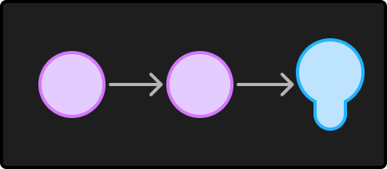

> Hey Y'all! This is a translation of my blog post originally written in Portuguese.

> Revised [11/12/2024]
>
> Hi folks, so I had to make some changes here in the post to add some interactive widgets,
> and I took the opportunity to give a bit more context to the content.

Hello, this is the first article in a series about the fundamentals of computing. The idea is to demonstrate in a simple and practical way how this device transforms zeros and ones into practically anything, the functioning of CPUs and other interesting subjects. So, to start, the first concept we have to learn is that of logic gates: they are the foundation of all computing, with them we can do certain operations that receive as input one or more values and will have another value as a result.

But what are these values? The number 42? My mother's name? These "values" are energy, more specifically the presence and absence of it. As mentioned in the introduction, computers work using binary digits, meaning these machines only understand 0 and 1 or "Has energy" and "No energy". However, we won't call these zeros and ones energy, for the computer they are signals.

When signals are combined and/or compared, we call it a logical operation, for example.

"[Harp sounds of story beginning]"

One day you hire an electrical company to install two switches in a hallway of your house, but due to a design error, the installation ends up like this: the wire passes through the first switch (let's call it switch A), goes straight to the second switch (B for intimates) and then exits to the lamp.



Did you notice that the lamp only lights up if both switches are on at the same time? If either one is turned off, the light goes out immediately! Well, this residential electrical atrocity can be explained, in mathematics, from one of its branches called boolean algebra, and in it we can demonstrate this with a table:

| ∧ | 0 | 1 |
| :-----: | :-----: | :-----: |
| 0 | 0 | 0 |
| 1 | 0 | 1 |

Writing this another way looks like this:

| ∧ | A off | A on |
| :----- | :----- | :----- |
| B off | Light off | Light off |
| B on | Light off | Light on |

If you noticed well, now we have a way to represent what we want to happen with two switches and a lamp, and this example shown above is the first logic gate we're getting to know, the AND or Conjunction, and this table, demonstrated above in different forms, is called a Truth Table.

Ok, but what about my house light? How is it going to be? I need the light to turn on when A OR B is on. How do you do that?

The answer is in the question itself! 😉 We'll need another logic gate, the OR or Disjunction, and to understand how it works, let's use a truth table that fits these conditions:

| ? | 0 | 1 |
| :-----: | :-----: | :-----: |
| 0 | 0 | 1 |
| 1 | 1 | 1 |

But before talking about OR, let's take a look at the NOT gate (or Negation). It's quite simple, but it will be important later on.

```circ
input a

not _not_(in=a.out)
led out(in=_not_.out)

```

And if we write it in a truth table we'll have this here:

| ¬ | 0 | 1 |
| :-----: | :-----: | :-----: |
|  | 1 | 0 |

So, let's take a break and review what we already know. First, the operations and how to represent them in a table. To simplify, let's transform these operations into symbols. Every time we refer to AND, this will be the symbol:

```circ
input a, b

and _and_(a=a.out, b=b.out)
led out(in=_and_.out)
```

and the NOT:

```circ
input a

not _not_(in=a.out)
led out(in=_not_.out)
```

With these two logical operations (AND and NOT), we can already combine their results and create a third logic gate: the NAND (or Not AND).

It can be represented like this:

```circ
import nand "<builtin>/nand.circ"

input a, b

nand _nand_(a=a.out, b=b.out)
led out(in=_nand_.out)
```

```circ
input a, b

and _and_(a=a.out, b=b.out)
not _not_(in=_and_.out)
led out(in=_not_.out)
```

Its truth table is identical to AND's, but with the results inverted.

| ¬∧ | 0 | 1 |
| :-----: | :-----: | :-----: |
| 0 | 1 | 1 |
| 1 | 1 | 0 |

Following this same logic of combining gates, we can use a NAND gate and invert each switch input with a NOT. Thus, we'll have the following:

```circ
import nand "<builtin>/nand.circ"

input a, b

not _not_a_(in=a.out)
not _not_b_(in=b.out)
nand _nand_(a=_not_a_.out, b=_not_b_.out)
led out(in=_nand_.out)
```

Analyzing the diagram above, we see that when both switches are off, both signals will be inverted by the NOT, and the NAND will result in ¬∧(1, 1) = 0. So with both off, the lamp turns off. But what happens when we have ¬∧(1, 0) or ¬∧(0, 1)? To find out, let's analyze the truth table:

| ∨ | 0 | 1 |
| :-----: | :-----: | :-----: |
| 0 | 0 | 1 |
| 1 | 1 | 1 |


But wait a minute, I have the impression that I've seen this table before? Yes! This is the OR logic gate we were looking for. Quite a journey, isn't it? Now that we know how to fix the lamp wiring, we can take a break here. This is just the first article in a series about computers. Later on, we'll address other logic gates and other computing concepts.

## References

* [Boolean algebra (Wikipedia)](https://pt.wikipedia.org/wiki/%C3%81lgebra_booliana)
* [Boolean Algebra (Wikipedia)](https://en.wikipedia.org/wiki/Boolean_algebra)
* [Truth table (Wikipedia)](https://pt.wikipedia.org/wiki/Tabela-verdade)
* [Exploring How Computers Work (YouTube)](https://www.youtube.com/watch?v=QZwneRb-zqA)
* [Making logic gates from transistors (YouTube)](https://www.youtube.com/watch?v=sTu3LwpF6XI)
* [HOW TRANSISTORS RUN CODE? (YouTube)](https://www.youtube.com/watch?v=HjneAhCy2N4)
