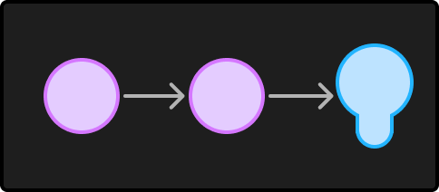

> Revisado [11/12/2024]
>
> Oi pessoal, então tive que fazer umas mudanças aqui no post pra adicionar alguns widgets
> interativos, e aproveitei para dar um pouco mais de contexto ao conteúdo.

Loading the <a href="https://elevenlabs.io/text-to-speech" target="_blank" rel="noopener">Elevenlabs Text to Speech</a> AudioNative Player...

Olá, este é o primeiro artigo de uma série sobre os fundamentos da computação. A ideia é demonstrar de forma simples e prática como este dispositivo transforma zeros e uns em praticamente qualquer coisa, o funcionamento das CPUs e outros assuntos interessantes. Então, para começar, o primeiro conceito que temos que aprender é o de portas lógicas: elas são a base de toda a computação, com elas podemos fazer certas operações que recebem como entrada um ou mais valores e terão outro valor como resultado.

Mas o que são esses valores? O número 42? O nome da minha mãe? Esses “valores” são energia, mais especificamente a presença e ausência dela. Como foi falado na introdução, computadores funcionam utilizando dígitos binários, ou seja, essas máquinas só entendem 0 e 1 ou “Tem energia” e “Não tem energia”. No entanto, não iremos chamar esses zeros e uns de energia, para o computador eles são sinais.

Quando sinais são combinados e/ou comparados, nós chamamos de operação lógica, por exemplo.

“[Sons de harpa de inicio de história]”

Um dia você contrata uma empresa de elétrica para instalar dois interruptores em um corredor da sua casa, mas, por um erro de desenho, a instalação acaba ficando da seguinte forma: o fio passa pelo primeiro interruptor (vamos chamar de interruptor A), vai direto para o segundo interruptor (B para os íntimos) e, em seguida, sai para a lâmpada.

Reparou que a lâmpada só acende se os dois interruptores estiverem ligados ao mesmo tempo? Se qualquer um deles for desligado, a luz apaga na hora! Pois é, essa atrocidade da elétrica residencial pode ser explicada, na matemática, a partir de um de seus ramos chamado de álgebra booleana, e nela podemos demonstrar isso com uma tabela:

| ∧ | 0 | 1 |
| :-----: | :-----: | :-----: |
| 0 | 0 | 0 |
| 1 | 0 | 1 |

Escrevendo isso de outro modo fica assim:

| ∧ | A desligado | A ligado |
| :----- | :----- | :----- |
| B desligado | Luz apagada | Luz apagada |
| B ligado | Luz apagada | Luz acesa |

Se você percebeu bem, agora temos um jeito de representar o que queremos que aconteça com dois interruptores e uma lâmpada, e esse exemplo mostrado acima é a primeira porta lógica que estamos conhecendo, o AND ou Conjunção, e essa tabela, demonstrada acima de formas diferentes, se chama Tabela-Verdade.

Ok, mas e a luz da minha casa? Como que vai ficar? Eu preciso que a luz acenda quando o A OU B estiverem ligados. Como que faz isso?

A resposta está na própria pergunta! 😉 Vamos precisar de uma outra porta lógica, a OR ou Disjunção, e para entender como ela funciona, vamos usar uma tabela-verdade que se encaixe nessas condições:

| ? | 0 | 1 |
| :-----: | :-----: | :-----: |
| 0 | 0 | 1 |
| 1 | 1 | 1 |

Mas antes de falar da OR, vamos dar uma olhada na porta NOT (ou Negação). Ela é bem simples, mas vai ser importante mais pra frente.


E se escrevermos ela numa tabela verdade teremos isso aqui:

| ¬ | 0 | 1 |
| :-----: | :-----: | :-----: |
|  | 1 | 0 |

Então, vamos fazer uma pausa e revisar o que a gente já sabe. Primeiro, as operações e como representá-las numa tabela. Para simplificar, vamos transformar essas operações em símbolos. Toda vez que nos referirmos ao AND, este será o símbolo:



e o NOT:



Com essas duas operações lógicas (AND e NOT), já podemos combinar seus resultados e criar uma terceira porta lógica: a NAND (ou Not AND).

Ela pode ser representada assim:





A tabela-verdade dela é idêntica à do AND, porém com os resultados invertidos.

| ¬∧ | 0 | 1 |
| :-----: | :-----: | :-----: |
| 0 | 1 | 1 |
| 1 | 1 | 0 |

Seguindo essa mesma lógica de combinar portas, podemos usar uma porta NAND e inverter a entrada de cada interruptor com um NOT. Assim, teremos o seguinte:



Analisando o diagrama acima, vemos que, quando os dois interruptores estiverem desligados, ambos os sinais serão invertidos pelo NOT, e o NAND vai resultar em ¬∧(1, 1) = 0. Ou seja, com ambos desligados, a lâmpada apaga. Mas o que acontece quando temos ¬∧(1, 0) ou ¬∧(0, 1)? Para descobrir, vamos analisar a tabela-verdade:

| ∨ | 0 | 1 |
| :-----: | :-----: | :-----: |
| 0 | 0 | 1 |
| 1 | 1 | 1 |

Mas espera um pouco, eu tenho a impressão de que eu já vi essa tabela antes? Sim! Essa é a porta lógica OR que estávamos procurando. Uma viagem e tanto, não é? Agora que já sabemos como consertar a fiação da lâmpada, podemos dar uma paradinha aqui. Este é apenas o primeiro artigo de uma série sobre computadores. Mais para frente, vamos abordar outras portas lógicas e outros conceitos da computação.

Referências

* [Álgebra booliana (Wikipédia)](https://pt.wikipedia.org/wiki/%C3%81lgebra_booliana)
* [Boolean Algebra (Wikipédia)](https://en.wikipedia.org/wiki/Boolean_algebra)
* [Tabela-verdade  (Wikipédia)](https://pt.wikipedia.org/wiki/Tabela-verdade)
* [Exploring How Computers Work (YouTube)](https://www.youtube.com/watch?v=QZwneRb-zqA)
* [Making logic gates from transistors (YouTube)](https://www.youtube.com/watch?v=sTu3LwpF6XI)
* [HOW TRANSISTORS RUN CODE? (YouTube)](https://www.youtube.com/watch?v=HjneAhCy2N4)
