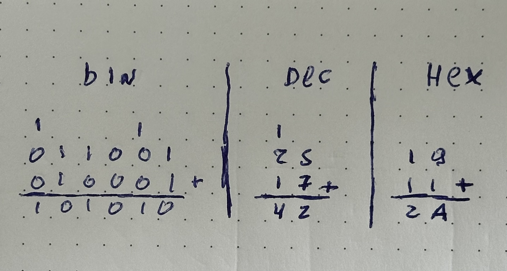

> Hey Y'all! This is a translation of my blog post originally written in Portuguese.
> If you want to read that version, [click here](/blog/the-binary/).

> Hello people of this internet, for those who are arriving here now, this is the second article of
> a series I'm doing to talk about the fundamentals of computing, I recommend reading the
> first one about [logic gates](https://jeffersonmourak.com/blog/logic-gates/).
> And for those who have already read the first article, take a quick look there because I did a revision of the article, I highly recommend taking a look 😊

<div id="elevenlabs-audionative-widget" data-height="90" data-width="100%" data-frameborder="no" data-scrolling="no" data-publicuserid="2be4d6242c862832d6b47ec70f7d7daf2c9f1306c933439f7083622af43fe99f" data-playerurl="https://elevenlabs.io/player/index.html" >Loading the <a href="https://elevenlabs.io/text-to-speech" target="_blank" rel="noopener">Elevenlabs Text to Speech</a> AudioNative Player...</div><script src="https://elevenlabs.io/player/audioNativeHelper.js" type="text/javascript"></script>

Let's dive a bit deeper and explore some concepts of mathematics and also human history.

Mathematics came from the human race's need to count and measure – how many animals Maria takes care of, how many days until the next solstice... Over time and human expansion, ancient peoples created various numbering systems for their daily lives. Games like _Grand Theft Auto V_, _Call of Duty: Black Ops III_, _Dragon Quest XI_ are examples of using the numeral system that the Romans used, and the _I Ching_, an ancient Chinese text, has roots in binary representations.

However, not only ancient civilizations used other numerical systems. The hours of a day are divided between 12 hours of the morning period and 12 hours of the afternoon period, or a dozen eggs. In the French language, there are still remnants of a vigesimal-based system (20), for example, the number 80 is said as _quatre-vingts_ (four twenties), and one of the most recent is Braille, which also has roots in binary representations.

Nowadays, we use decimal representation, and the reason is quite simple: the average number of fingers on human hands is an incredible 10 fingers, so it's easier to count using only hands.

## ☝️ + ☝️ = ✌️

This base 10 representation is positional, meaning the position in which the digits are "drawn" changes the quantity being represented. _70_ represents ten times more than _07_, hence the popular saying "zero to the left". In school, we learn about decimal places – _units_, _tens_, _hundreds_... They serve to represent what the position of that digit is.

| Tens | Units |
| :----: | ------- |
|   7    |   0     |
|   0    |   7     |

And on top of this order, there's a mathematical formula that converts a number from any base to decimal. To make it easier:

- **Digit**: Symbol that represents a unique quantity.
  _Ex.: 1, 2, 3, 4, 5, 6, 7, 8, 9, 0_
- **Number**: Digits organized in order of _**position**_.
  _Ex.: 10, 144, 999, 42, 37, `0x8A6C`, `0b101010`_
- **Base**: Maximum quantity of digits that can be represented.
  _Ex.: binary (`0b`) 2, decimal 10, hexadecimal (`0x`)_
- **Index**: The magnitude of the digit in the position.
  _Ex.: 10, the 1 in 10 has _Index 1_ and the 0 has _Index 0_ (it's a bit counterintuitive, but it makes sense).
  In other words, the index is the position from right to left, starting at 0.

The formula is quite simple: _**(d)igit × (b)ase<sup>(i)ndex</sup>**_. In the example we're doing, this is the formula to convert 70 to decimal... to 70 in decimal. **7 × 10<sup>1</sup> + 0 × 10<sup>0</sup> = 70**



When we talk about numbers this way, it becomes easier to represent binary, which is nothing more than the quantity that can be represented by the formula _**d × 2<sup>i</sup>**_.



And this way of representing quantities can also be manipulated with mathematical operations. The addition 25 + 17 is solved in a way similar to this.

```
1
2 5
1 7
--- +
4 2
```

In the example above, we have some elements that need to be highlighted:

1. A _digit_ can only be added to another _digit_ that is in the same _index_.
2. When the sum cannot be represented with just one digit, the smallest index is kept as the _result_, and the _remainder_ is sent to the next index.
3. The _result_ of a sum will always be the sum of the _**digits**_ of the _**index**_ + the _**remainder**_ that came from the _**digit**_ in the previous _**index**_.

With these same steps, we can apply addition in any base.

```
    1 1 1       |  1      |  
1 0 0 0 1 1     |  2 5    |  1 9
0 0 0 1 1 1     |  1 7    |  1 1
------------ +  |  --- +  |  --- +
1 0 1 0 1 0     |  4 2    |  2 A 
```





Now that we already know each other, how can we make the computer know us too?

## Playing with translation

Remembering the [previous article](https://jeffersonmourak.com/blog/logic-gates/), let's isolate the addition of two digits in tables. First, let's look at just the result. We have this table that very much resembles the OR gate table, except for this small change at the end.

<div style="display: flex; gap: 16px;">
<span>
<table>
<tr><td colspan="3">Result</td></tr>
<tr>
 <td>?</td>
 <td>0</td>
 <td>1</td>
</tr>
<tr>
 <td>0</td>
 <td>0</td>
 <td>1</td>
</tr>
<tr>
 <td>1</td>
 <td>1</td>
 <td>0</td>
</tr>
</table>
</span>
<span>
<table>
<tr><td colspan="3">OR</td></tr>
<tr>
 <td>∨</td>
 <td>0</td>
 <td>1</td>
</tr>
<tr>
 <td>0</td>
 <td>0</td>
 <td>1</td>
</tr>
<tr>
 <td>1</td>
 <td>1</td>
 <td>1</td>
</tr>
</table>
</span>
</div>

For this, we can combine the results of the gates we saw earlier into a single circuit called "Exclusive OR" or "XOR".


Now, let's also look at the remainder table of our addition and you'll notice that it's an exact copy of the AND gate.

<div style="display: flex; gap: 16px;">
<span>
<table>
<tr><td colspan="3">Remainder</td></tr>
<tr>
 <td>?</td>
 <td>0</td>
 <td>1</td>
</tr>
<tr>
 <td>0</td>
 <td>0</td>
 <td>0</td>
</tr>
<tr>
 <td>1</td>
 <td>0</td>
 <td>1</td>
</tr>
</table>
</span>
<span>
<table>
<tr><td colspan="3">AND</td></tr>
<tr>
 <td>∧</td>
 <td>0</td>
 <td>1</td>
</tr>
<tr>
 <td>0</td>
 <td>0</td>
 <td>0</td>
</tr>
<tr>
 <td>1</td>
 <td>0</td>
 <td>1</td>
</tr>
</table>
</span>
</div>

And just like Captain Planet, "By the union of their powers", we will be able to perform the operation of adding two digits in binary, and this component is called "Adder".



With this combination of logic gates, a computer can already perform the incredible additions of: `0 + 0`, `1 + 0`, `0 + 1`, `1 + 1`, but beyond that, it can also say how much remainder there was from the addition. And when several ADDERs are combined, we can perform addition of more complex numbers like 42, but that we'll see in the next article.

That's all for today, folks.


References

- [A brief history of numerical systems (Youtube)](https://pt.wikipedia.org/wiki/%C3%81lgebra_booliana)
- [Numeral system (Wikipédia)](https://en.wikipedia.org/wiki/Numeral_system)
- [Sistema de numeração (Wikipédia)](https://pt.wikipedia.org/wiki/Sistema_de_numera%C3%A7%C3%A3o)
- [Exploring How Computers Work (YouTube)](https://www.youtube.com/watch?v=QZwneRb-zqA)
- [Making logic gates from transistors (YouTube)](https://www.youtube.com/watch?v=sTu3LwpF6XI)
- [HOW TRANSISTORS RUN CODE? (YouTube)](https://www.youtube.com/watch?v=HjneAhCy2N4)
- [From Nand to Tetris](https://www.nand2tetris.org/)
