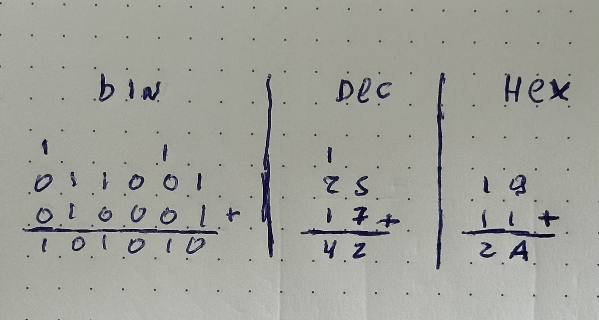

> Olá pessoas dessa internet, para quem está chegando aqui agora, este é o segundo artigo de
> uma série que estou fazendo para falar sobre os fundamentos da computação, recomendo ler o
> primeiro sobre [portas lógicas](https://jeffersonmourak.com/blog/logic-gates/).
> E para quem já leu o primeiro artigo, dá um pulinho lá porque eu fiz uma revisão no artigo, recomendo bastante dar uma olhada 😊

Vamos nos aprofundar um pouco mais e explorar alguns conceitos de matemática e também da história humana.

A matemática veio da necessidade de contar e medir da raça humana – quantos animais a Maria cuida, quantos dias até o próximo solstício... Com o tempo e a expansão humana, povos antigos criaram vários sistemas de numeração para o seu dia a dia. Jogos como _Grand Theft Auto V_, _Call of Duty: Black Ops III_, _Dragon Quest XI_ são exemplos de uso do sistema numeral que os romanos usavam, e o _I Ching_, um antigo texto chinês, tem raízes em representações binárias.

Porém, não somente as antigas civilizações usavam outros sistemas numéricos. As horas de um dia são divididas entre 12 horas do período da manhã e 12 horas do período da tarde, ou uma dúzia de ovos. Na língua francesa ainda existem resquícios de um sistema com base vigesimal (20), por exemplo, o número 80 se diz _quatre-vingts_ (quatro vintes), e um dos mais recentes é o Braille, que também tem raízes em representações binárias.

Nos dias atuais, utilizamos a representação decimal, e o motivo é bem simples: a média de dedos em mãos humanas são incríveis 10 dedos, sendo assim fica mais fácil contar usando somente as mãos.

## ☝️ + ☝️ = ✌️

Essa representação em base 10 é posicional, ou seja, a posição em que os dígitos são "desenhados" muda a quantidade que se está representando. _70_ representa dez vezes mais que _07_, daí vem o ditado popular "zero à esquerda". Na escola, aprendemos as casas decimais – _unidades_, _dezenas_, _centenas_... Elas servem para representar qual é a posição desse dígito.

| Dezena | Unidade |
| :----: | ------- |
|    7    |   0      |
|    0    |   7      |

E em cima dessa ordem existe uma fórmula matemática que converte um número de qualquer base para decimal. Para facilitar:

- **Dígito**: Símbolo que representa uma quantidade única.
  _Ex.: 1, 2, 3, 4, 5, 6, 7, 8, 9, 0_
- **Número**: Dígitos organizados em ordem de _**posição**_.
  _Ex.: 10, 144, 999, 42, 37, `0x8A6C`, `0b101010`_
- **Base**: Quantidade máxima de dígitos que pode ser representada.
  _Ex.: binário (`0b`) 2, decimal 10, hexadecimal (`0x`)_
- **Índice**: A magnitude do dígito na posição.
  _Ex.: 10, o 1 em 10 tem _Índice 1_ e o 0 tem _Índice 0_ (é meio contraintuitivo, mas faz sentido).
  Em outras palavras, o índice é a posição da direita para a esquerda, começando em 0.

A fórmula é bem simples: _**(d)ígito × (b)ase<sup>(i)ndice</sup>**_. No exemplo que estamos fazendo, esta é a fórmula para converter 70 em decimal... para 70 em decimal. **7 × 10<sup>1</sup> + 0 × 10<sup>0</sup> = 70**



Quando falamos de números dessa forma, fica mais fácil representar o binário, que nada mais é que a quantidade que pode ser representada pela fórmula _**d × 2<sup>i</sup>**_.



E essa forma de representar quantidades também pode ser manipulada com operações matemáticas. A adição 25 + 17 é resolvida de modo parecido com isso.

```
1
2 5
1 7
--- +
4 2
```

No exemplo acima, temos alguns elementos que precisam ser destacados:

1. Um _dígito_ só pode ser somado com outro _dígito_ que estiver no mesmo _índice_.
2. Quando a soma não puder ser representada com apenas um dígito, o menor índice é mantido como _resultado_, e o _resto_ é enviado para o próximo índice.
3. O _resultado_ de uma soma será sempre a soma dos _**dígitos**_ do _**índice**_ + o _**resto**_ que veio do _**dígito**_ no _**índice**_ anterior.

Com esses mesmos passos, podemos aplicar a soma em qualquer base.

```
    1 1 1       |  1      |  
1 0 0 0 1 1     |  2 5    |  1 9
0 0 0 1 1 1     |  1 7    |  1 1
------------ +  |  --- +  |  --- +
1 0 1 0 1 0     |  4 2    |  2 A 
```





Agora que já nos conhecemos, como podemos fazer para o computador nos conhecer também?

## Brincando de tradução

Lembrando do [artigo anterior](https://jeffersonmourak.com/blog/logic-gates/), vamos isolar a soma de dois dígitos em tabelas. A primeira, vamos olhar para o resultado apenas. Temos esta tabela que se assemelha muito com a tabela da porta OR, exceto por essa pequena mudança no final.

<div style="display: flex; gap: 16px;">
<span>
<table>
<tr><td colspan="3">Resultado</td></tr>
<tr>
 <td>?</td>
 <td>0</td>
 <td>1</td>
</tr>
<tr>
 <td>0</td>
 <td>0</td>
 <td>1</td>
</tr>
<tr>
 <td>1</td>
 <td>1</td>
 <td>0</td>
</tr>
</table>
</span>
<span>
<table>
<tr><td colspan="3">OR</td></tr>
<tr>
 <td>∨</td>
 <td>0</td>
 <td>1</td>
</tr>
<tr>
 <td>0</td>
 <td>0</td>
 <td>1</td>
</tr>
<tr>
 <td>1</td>
 <td>1</td>
 <td>1</td>
</tr>
</table>
</span>
</div>

Para isso, podemos combinar o resultado das portas que já vimos anteriormente em um só circuito chamado "OU Exclusivo" ou "XOR".


Agora, vamos olhar também para a tabela do resto da nossa soma e se percebe que é uma cópia exata da porta AND.

<div style="display: flex; gap: 16px;">
<span>
<table>
<tr><td colspan="3">Resto</td></tr>
<tr>
 <td>?</td>
 <td>0</td>
 <td>1</td>
</tr>
<tr>
 <td>0</td>
 <td>0</td>
 <td>0</td>
</tr>
<tr>
 <td>1</td>
 <td>0</td>
 <td>1</td>
</tr>
</table>
</span>
<span>
<table>
<tr><td colspan="3">AND</td></tr>
<tr>
 <td>∧</td>
 <td>0</td>
 <td>1</td>
</tr>
<tr>
 <td>0</td>
 <td>0</td>
 <td>0</td>
</tr>
<tr>
 <td>1</td>
 <td>0</td>
 <td>1</td>
</tr>
</table>
</span>
</div>

E assim como o Capitão Planeta, "Pela união dos seus poderes", nós vamos conseguir fazer a operação de soma de dois dígitos em binário, e esse componente é chamado de "Somador" ou "Adder".



Com essa combinação de portas lógicas, um computador já consegue fazer as incríveis somas de: `0 + 0`, `1 + 0`, `0 + 1`, `1 + 1`, mas, além disso, ele consegue também dizer quanto que houve de resto da soma. E quando combinados vários ADDERs, a gente consegue fazer uma soma de números mais complexos como o 42, mas essa nós vamos ver no próximo artigo.

Por hoje é só isso, pessoal.
<div style="width:100%;height:0;padding-bottom:56%;position:relative;"><iframe src="https://giphy.com/embed/xUPOqo6E1XvWXwlCyQ" width="100%" height="100%" style="position:absolute" frameBorder="0" class="giphy-embed" allowFullScreen></iframe></div>

Referências

- [A brief history of numerical systems (Youtube)](https://pt.wikipedia.org/wiki/%C3%81lgebra_booliana)
- [Numeral system (Wikipédia)](https://en.wikipedia.org/wiki/Numeral_system)
- [Sistema de numeração (Wikipédia)](https://pt.wikipedia.org/wiki/Sistema_de_numera%C3%A7%C3%A3o)
- [Exploring How Computers Work (YouTube)](https://www.youtube.com/watch?v=QZwneRb-zqA)
- [Making logic gates from transistors (YouTube)](https://www.youtube.com/watch?v=sTu3LwpF6XI)
- [HOW TRANSISTORS RUN CODE? (YouTube)](https://www.youtube.com/watch?v=HjneAhCy2N4)
- [From Nand to Tetris](https://www.nand2tetris.org/)
